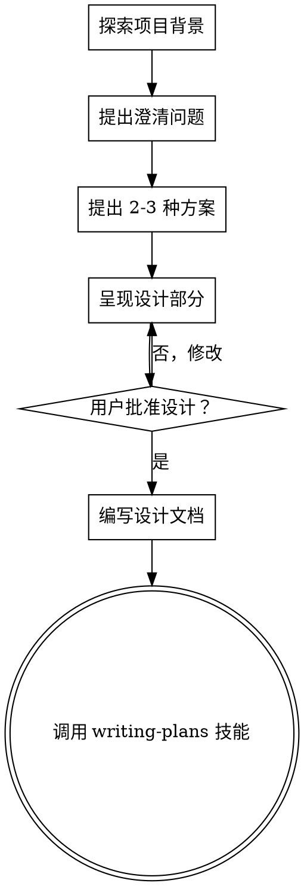

# 将想法转化为设计

## 概述

通过自然的协作对话，帮助将想法转化为完整形成的设计和规范。

首先了解当前项目背景，然后一次一个问题地细化想法。一旦你理解了要构建的内容，呈现设计并获得用户批准。

<HARD-GATE>
在你呈现设计并获得用户批准之前，不要调用任何实现技能、编写任何代码、搭建任何项目或采取任何实施行动。这适用于每个项目，无论感知到的简单性如何。
</HARD-GATE>

## 反模式："这太简单了，不需要设计"

每个项目都会经历这个过程。待办事项列表、单功能工具、配置更改——所有这些。"简单"项目是未经检验的假设造成最多浪费工作的地方。设计可以很短（真正简单的项目几句话），但你必须呈现它并获得批准。

## 检查清单

你必须为每个项目创建一个任务，并按顺序完成：

1. **探索项目背景** — 检查文件、文档、最近的提交
2. **提出澄清问题** — 一次一个，了解目的/约束/成功标准
3. **提出 2-3 种方案** — 包含权衡和你的建议
4. **呈现设计** — 按复杂度缩放各部分，在每个部分后获得用户批准
5. **编写设计文档** — 保存到 `docs/plans/YYYY-MM-DD-<topic>-design.md` 并提交
6. **过渡到实施** — 调用 writing-plans 技能来创建实施计划

## 流程图

**最终状态是调用 writing-plans。** 不要调用 frontend-design、mcp-builder 或任何其他实现技能。头脑风暴后唯一调用的技能是 writing-plans。

## 流程

**理解想法：**
- 首先查看当前项目状态（文件、文档、最近的提交）
- 一次一个问题地细化想法
- 尽可能使用选择题，但开放性问题也可以
- 每条消息只问一个问题——如果一个主题需要更多探索，将其分成多个问题
- 专注于理解：目的、约束、成功标准

**探索方案：**
- 提出 2-3 种不同的方案，包含权衡
- 对话式地呈现选项，包含你的建议和推理
- 首先提出你推荐的选项并解释原因

**呈现设计：**
- 一旦你认为理解了要构建的内容，就呈现设计
- 按复杂度缩放每个部分：简单的几句话，复杂的多达 200-300 字
- 在每个部分后询问是否看起来正确
- 涵盖：架构、组件、数据流、错误处理、测试
- 准备好返回并澄清不合理的地方

## 设计之后

**文档：**
- 将验证后的设计写入 `docs/plans/YYYY-MM-DD-<topic>-design.md`
- 如果可用，使用 elements-of-style:writing-clearly-and-concisely 技能
- 将设计文档提交到 git

**实施：**
- 调用 writing-plans 技能来创建详细的实施计划
- 不要调用任何其他技能。writing-plans 是下一步。

## 关键原则

- **一次只问一个问题** — 不要用多个问题淹没用户
- **优先使用选择题** — 比开放性问题更容易回答
- **无情地遵循 YAGNI** — 从所有设计中删除不必要的功能
- **探索替代方案** — 在确定之前始终提出 2-3 种方案
- **增量验证** — 呈现设计，获得批准后再继续
- **保持灵活** — 当事情不合理时返回并澄清
