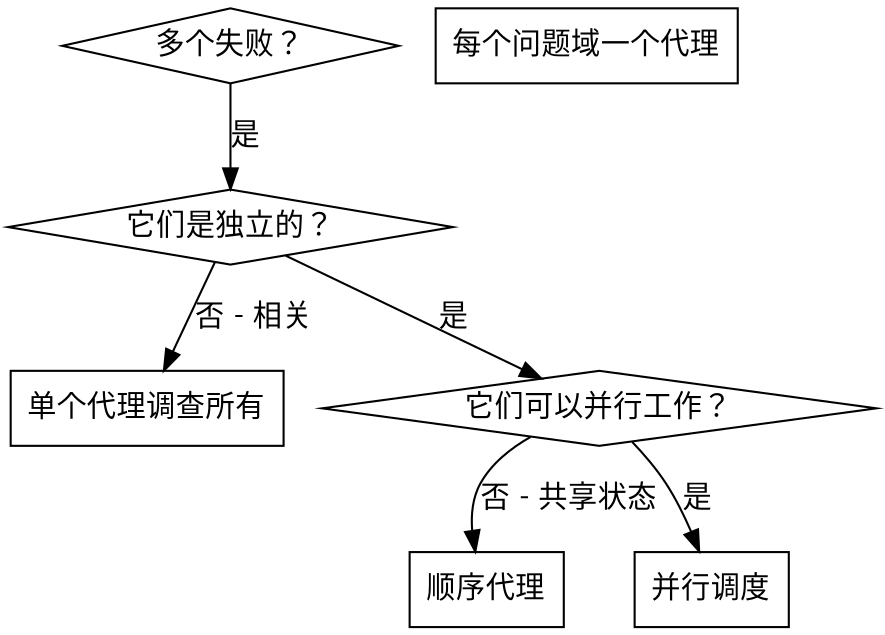

# 调度并行代理

## 概述

当你有多个不相关的失败（不同的测试文件、不同的子系统、不同的 bug）时，顺序调查它们会浪费时间。每次调查都是独立的，可以并行进行。

**核心原则：** 每个独立的问题域调度一个代理。让它们同时工作。

## 何时使用



**使用场景：**
- 3 个或更多测试文件因不同根本原因失败
- 多个子系统独立损坏
- 每个问题可以在不借助其他上下文的情况下理解
- 调查之间没有共享状态

**不使用场景：**
- 失败是相关的（修复一个可能会修复其他）
- 需要了解完整的系统状态
- 代理会相互干扰

## 模式

### 1. 识别独立域

按损坏的内容分组失败：
- 文件 A 测试：工具审批流程
- 文件 B 测试：批量完成行为
- 文件 C 测试：中止功能

每个域都是独立的——修复工具审批不会影响中止测试。

### 2. 创建聚焦的代理任务

每个代理获得：
- **特定范围：** 一个测试文件或子系统
- **明确目标：** 让这些测试通过
- **约束：** 不要更改其他代码
- **预期输出：** 你发现和修复的内容摘要

### 3. 并行调度

```typescript
// 在 Claude Code / AI 环境中
Task("修复 agent-tool-abort.test.ts 失败")
Task("修复 batch-completion-behavior.test.ts 失败")
Task("修复 tool-approval-race-conditions.test.ts 失败")
// 这三个同时运行
```

### 4. 审查和集成

当代理返回时：
- 阅读每个摘要
- 验证修复不冲突
- 运行完整测试套件
- 集成所有更改

## 代理提示结构

好的代理提示：
1. **聚焦** — 一个清晰的问题域
2. **自包含** — 理解问题所需的所有上下文
3. **明确输出** — 代理应该返回什么？

```markdown
修复 src/agents/agent-tool-abort.test.ts 中 3 个失败的测试：

1. "should abort tool with partial output capture" - 期望在消息中看到 'interrupted at'
2. "should handle mixed completed and aborted tools" - 快速工具被中止而不是完成
3. "should properly track pendingToolCount" - 期望 3 个结果但得到 0

这些是时序/竞态条件问题。你的任务：

1. 阅读测试文件并理解每个测试验证什么
2. 找出根本原因 - 时序问题还是实际 bug？
3. 修复方法：
   - 用基于事件的等待替换任意超时
   - 如果发现中止实现中的 bug，进行修复
   - 如果测试改变了行为，调整测试期望

不要只是增加超时时间——找到真正的问题。

返回：你发现的内容和修复内容的摘要。
```

## 常见错误

**❌ 范围太广：** "修复所有测试" — 代理会迷失
**✅ 明确具体：** "修复 agent-tool-abort.test.ts" — 范围聚焦

**❌ 没有上下文：** "修复竞态条件" — 代理不知道在哪里
**✅ 有上下文：** 粘贴错误消息和测试名称

**❌ 没有约束：** 代理可能会重构所有内容
**✅ 有约束：** "不要更改生产代码" 或 "只修复测试"

**❌ 输出模糊：** "修复它" — 你不知道改变了什么
**✅ 明确具体：** "返回根本原因和更改的摘要"

## 何时不使用

**相关失败：** 修复一个可能会修复其他——首先一起调查
**需要完整上下文：** 理解需要查看整个系统
**探索性调试：** 你还不知道哪里坏了
**共享状态：** 代理会相互干扰（编辑相同的文件，使用相同的资源）

## 会话中的真实示例

**场景：** 重大重构后，3 个文件中有 6 个测试失败

**失败：**
- agent-tool-abort.test.ts: 3 个失败（时序问题）
- batch-completion-behavior.test.ts: 2 个失败（工具未执行）
- tool-approval-race-conditions.test.ts: 1 个失败（执行计数 = 0）

**决策：** 独立域——中止逻辑与批量完成分开，与竞态条件分开

**调度：**
```
代理 1 → 修复 agent-tool-abort.test.ts
代理 2 → 修复 batch-completion-behavior.test.ts
代理 3 → 修复 tool-approval-race-conditions.test.ts
```

**结果：**
- 代理 1：用基于事件的等待替换超时
- 代理 2：修复事件结构 bug（threadId 位置错误）
- 代理 3：添加等待异步工具执行完成

**集成：** 所有修复独立，无冲突，完整套件通过

**节省时间：** 3 个问题并行解决 vs 顺序解决

## 关键优势

1. **并行化** — 多个调查同时进行
2. **聚焦** — 每个代理范围狭窄，需要跟踪的上下文更少
3. **独立性** — 代理之间不会相互干扰
4. **速度** — 1 个时间解决 3 个问题

## 验证

代理返回后：
1. **审查每个摘要** — 理解改变了什么
2. **检查冲突** — 代理是否编辑了相同的代码？
3. **运行完整套件** — 验证所有修复一起工作
4. **抽查** — 代理可能犯系统性错误

## 现实影响

来自调试会话（2025-10-03）：
- 3 个文件中的 6 个失败
- 3 个代理并行调度
- 所有调查同时完成
- 所有修复成功集成
- 代理更改之间零冲突
