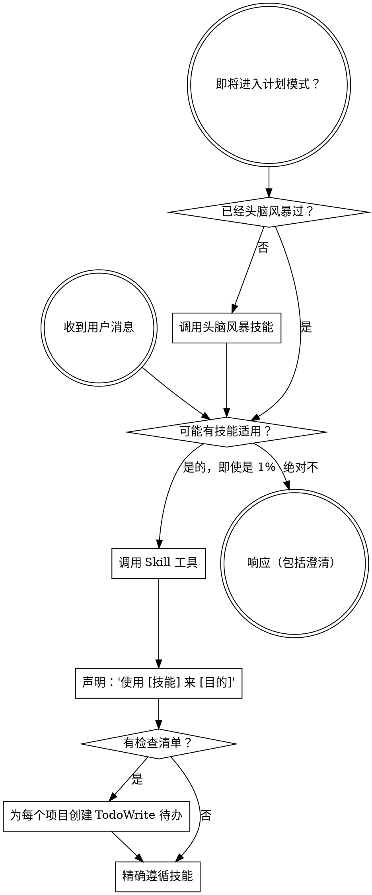

<极其重要>
如果你认为有 1% 的可能性某个技能可能适用于你正在做的事情，你绝对必须调用该技能。

如果一个技能适用于你的任务，你没有选择。你必须使用它。

这不可协商。这不是可选的。你不能理性地摆脱这一点。
</极其重要>

## 如何访问技能

**在 Claude Code 中：** 使用 `Skill` 工具。当你调用一个技能时，它的内容会被加载并呈现给你——直接遵循它。永远不要在技能文件上使用 Read 工具。

**在其他环境中：** 检查你的平台的文档以了解如何加载技能。

# 使用技能

## 规则

**在任何响应或行动之前调用相关或请求的技能。** 即使有 1% 的可能性某个技能可能适用，你也应该调用该技能来检查。如果调用的技能最终不适合这种情况，你不需要使用它。

## 红旗

这些想法意味着停止——你在合理化：

| 想法 | 现实 |
|---------|---------|
| "这只是一个简单的问题" |问题是任务。检查技能。|
| "我首先需要更多上下文" | 技能检查在澄清问题之前。|
| "让我先探索代码库" | 技能告诉你如何探索。先检查。|
| "我可以快速检查 git/文件" | 文件缺乏对话上下文。检查技能。|
| "让我先收集信息" | 技能告诉你如何收集信息。|
| "这不需要正式的技能" | 如果技能存在，使用它。|
| "我记得这个技能" | 技能会演变。阅读当前版本。|
| "这不算作任务" | 行动 = 任务。检查技能。|
| "这个技能太过了" | 简单的事情会变复杂。使用它。|
| "我只想先做这一件事" | 在做任何事情之前检查。|
| "这感觉很有成效" | 不受纪律约束的行动浪费时间。技能防止这种情况。|
| "我知道那是什么意思" | 知道概念 ≠ 使用技能。调用它。|

## 技能优先级

当多个技能可能适用时，按此顺序使用：

1. **首先使用流程技能**（头脑风暴、调试）——这些决定如何处理任务
2. **其次使用实施技能**（前端设计、mcp-builder）——这些指导执行

"让我们构建 X" → 首先头脑风暴，然后实施技能。
"修复这个 bug" → 首先调试，然后使用领域特定技能。

## 技能类型

**严格的**（TDD、调试）：精确遵循。不要偏离纪律。

**灵活的**（模式）：根据上下文调整原则。

技能本身会告诉你属于哪种。

## 用户指令

指令说的是什么，而不是如何做。"添加 X"或"修复 Y"并不意味着跳过工作流。
